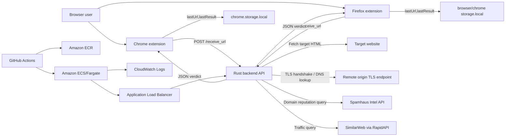
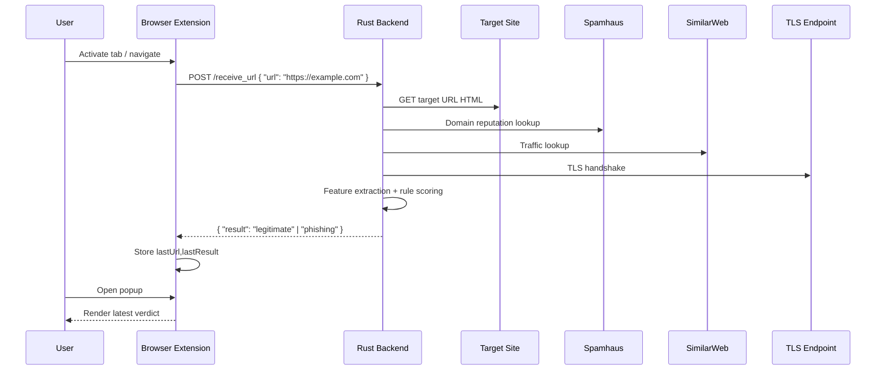

# Catch a Phish

## 1. Project overview

Catch a Phish is a browser-assisted phishing detection system that pairs lightweight Chrome and Firefox extensions with a Rust backend API. The extensions watch the active tab, send candidate URLs to the backend for analysis, and surface a simple `legitimate` or `phishing` verdict to the user. The project exists to give end users a fast, browser-native phishing signal while demonstrating a full software delivery lifecycle that includes containerization, AWS infrastructure, CI/CD, and a non-blocking DevSecOps pipeline.

### Key value propositions

- Real-time URL assessment from browser tab activity without leaving the current page.
- Rule-based phishing detection that combines URL heuristics, HTML inspection, TLS validation, traffic estimation, and Spamhaus domain intelligence.
- Portable Rust backend packaged as a Docker image and deployable to AWS ECS/Fargate.
- Reproducible browser extension packaging with build-time API endpoint injection.
- Built-in CI, deployment automation, Terraform infrastructure, and consolidated DevSecOps reporting.


## 2. Table of contents

- [1. Project overview](#1-project-overview)
- [2. Table of contents](#2-table-of-contents)
- [3. High-level architecture](#3-high-level-architecture)
- [4. Repository structure](#4-repository-structure)
- [5. Core functionality](#5-core-functionality)
- [6. Data pipelines & data flow](#6-data-pipelines--data-flow)
- [7. API & interface reference](#7-api--interface-reference)
- [8. Configuration & environment variables](#8-configuration--environment-variables)
- [9. Local development setup](#9-local-development-setup)
- [10. Testing strategy](#10-testing-strategy)
- [11. DevSecOps pipeline](#11-devsecops-pipeline)
- [12. Infrastructure & IaC](#12-infrastructure--iac)
- [13. Observability](#13-observability)
- [14. Security & compliance](#14-security--compliance)
- [15. Contributing](#15-contributing)
- [16. Changelog & versioning](#16-changelog--versioning)
- [17. License](#17-license)

## 3. High-level architecture

Catch a Phish is a small client-server system rather than a microservice estate. At runtime it consists of:

- browser-side presentation and event-capture clients in `chrome/` and `firefox/`
- a single Rust HTTP backend in `backend/`
- AWS infrastructure in `infra/terraform/` used to run the backend as a container on ECS/Fargate behind an Application Load Balancer
- GitHub Actions workflows in `.github/workflows/` for CI, deployment, and DevSecOps

### System design

- Runtime style: browser extensions + single backend API service
- Deployment style: containerized monolith
- Infrastructure style: Terraform-managed AWS ECS/Fargate
- Security/operations style: GitHub Actions with SCA, SAST, container scanning, secret scanning, DAST, and branch protection auditing

### Architecture diagram



### Layer mapping

| Layer | Directories / files | Notes |
| --- | --- | --- |
| Presentation | `chrome/`, `firefox/` | Browser extension background workers and popup UIs. |
| Business logic | `backend/src/` | URL feature extraction, phishing scoring, HTTP routes, external lookups. |
| Packaging / tooling | `scripts/`, `security/openapi/` | Extension packaging, security report consolidation, GitHub branch audit, DAST contract. |
| CI/CD & DevSecOps | `.github/workflows/`, `.github/dependabot.yml` | Build, security scans, dependency updates, deploy automation. |
| Infrastructure | `infra/terraform/` | AWS network, compute, IAM, ECR, logging, load balancing. |
| Documentation | `docs/` | Infrastructure and DevSecOps design notes. |

### External systems and third-party dependencies

Runtime-facing external systems:

- Spamhaus Intel API: domain reputation and WHOIS-derived registration length.
- SimilarWeb via RapidAPI: estimated traffic metrics.
- Arbitrary target websites: the backend fetches page HTML for feature extraction.
- DNS/TLS endpoints for the target hostname: used during certificate trust checks.
- Google Fonts: popup HTML loads the Inter font from Google Fonts.

Delivery and platform dependencies:

- GitHub Actions
- GitHub Code Scanning
- Dependabot
- AWS ECS/Fargate
- AWS ECR
- AWS ALB
- AWS CloudWatch Logs
- AWS IAM with GitHub OIDC

## 4. Repository structure

```text
.
├── .github/
│   ├── dependabot.yml                # Dependency update policy for Cargo, Docker, and GitHub Actions
│   └── workflows/
│       ├── ci.yml                    # Backend lint/test and extension packaging
│       ├── deploy-backend.yml        # ECR push + ECS rolling deployment
│       └── devsecops.yml             # Non-blocking security pipeline with consolidated reporting
├── backend/
│   ├── .dockerignore                 # Docker build exclusions
│   ├── Cargo.toml                    # Rust crate manifest
│   ├── Cargo.lock                    # Locked Rust dependency graph
│   ├── Dockerfile                    # Multi-stage image build for the backend
│   └── src/
│       ├── main.rs                   # HTTP server bootstrap and route registration
│       ├── routes.rs                 # `/health` and `/receive_url` handlers
│       ├── extractor.rs              # URL feature extraction and external lookups
│       ├── detector.rs               # Rule-based phishing scoring engine
│       ├── spamhaus.rs               # Spamhaus reputation lookup
│       ├── ssl_check.rs              # TLS trust/handshake verification
│       ├── traffic.rs                # SimilarWeb traffic lookup via RapidAPI
│       └── whois.rs                  # Unused WHOIS helper not wired into the server
├── chrome/
│   ├── background.js                 # Active-tab monitoring and backend request dispatch
│   ├── manifest.json                 # Manifest V3 extension definition
│   ├── icons/                        # Chrome extension icons
│   ├── popup/
│   │   ├── popup.html                # Popup UI shell
│   │   ├── popup.js                  # Verdict display logic
│   │   ├── background.png            # Popup background asset
│   │   └── logo.png                  # Popup logo asset
│   └── scripts/                      # Research / utility heuristics not integrated into runtime packaging
├── firefox/
│   ├── background.js                 # Firefox background script
│   ├── manifest.json                 # Manifest V2 Firefox definition
│   ├── popup.html                    # Popup UI shell
│   ├── popup.js                      # Verdict display logic
│   └── *.png                         # Extension assets and icons
├── infra/
│   └── terraform/
│       ├── versions.tf               # Terraform and provider version constraints
│       ├── variables.tf              # Input variables
│       ├── main.tf                   # AWS ECS/Fargate infrastructure
│       ├── outputs.tf                # Deployment bootstrap outputs
│       ├── terraform.tfvars.example  # Example environment configuration
│       └── README.md                 # Terraform bootstrap guide
├── scripts/
│   ├── build_extensions.py           # Builds zipped browser extension artifacts with injected API URL
│   ├── audit_branch_protection.py    # GitHub branch protection audit utility
│   └── consolidate_security_report.py# Merges DevSecOps findings into one report
├── security/
│   └── openapi/
│       └── backend-api.yaml          # OpenAPI contract used by the ZAP DAST job
├── docs/
│   ├── aws-bootstrap.md              # AWS bootstrap instructions
│   ├── ecs-fargate-deployment-technique.md
│   └── devsecops-pipeline.md
├── Artboard 1.png                    # Project asset
└── Catch a phish demo.mp4            # Demo artifact
```

Notes:

- `dist/`, `dist-test/`, `backend/target/`, Terraform state, and generated security reports are ignored via `.gitignore`.
- `chrome/scripts/` contains exploratory Python heuristics that are not invoked by the current runtime or CI workflows.
- The repository currently has no checked-in `LICENSE`, `CHANGELOG`, `.env.example`, `docker-compose`, or test fixture directories.

## 5. Core functionality

### 5.1 Browser-based phishing checks

What it does:

- Watches the active browser tab.
- Re-checks the URL when the active tab changes or the active tab navigates.
- Sends the URL to the backend.
- Stores the last checked URL and the verdict in browser-local storage.
- Displays the result in the popup UI.

Implemented in:

- `chrome/background.js`
- `chrome/popup/popup.js`
- `chrome/popup/popup.html`
- `firefox/background.js`
- `firefox/popup.js`
- `firefox/popup.html`
- `chrome/manifest.json`
- `firefox/manifest.json`

Design notes:

- The background scripts use `AbortController` so in-flight checks are canceled when the active URL changes.
- The popup UIs do not call the backend directly; they poll browser-local storage and render the last verdict.
- Both browser variants use a build-time `__API_BASE_URL__` placeholder that is replaced during packaging.

Known limitations visible in code:

- The popup polls every 500 ms rather than using a push/event-driven update model.
- The extension has no explicit offline or backend-unreachable UI state beyond generic console errors and `Unknown result`.
- The Chrome manifest contains a `applications.gecko` block, which is usually a Firefox-oriented field and may be vestigial.
- The Firefox extension is still on Manifest V2, which is legacy relative to current Chrome MV3 packaging.

### 5.2 Rule-based phishing detection backend

What it does:

- Exposes `/receive_url` to classify a submitted URL.
- Builds a feature map from URL structure, fetched HTML, TLS trust, traffic, and domain reputation.
- Applies a weighted rule engine to produce `phishing` or `legitimate`.

Implemented in:

- `backend/src/main.rs`
- `backend/src/routes.rs`
- `backend/src/extractor.rs`
- `backend/src/detector.rs`

Design notes:

- This is a deterministic rule engine, not an ML model.
- The detector sums a suspicion score and uses `>= 4.0` as the phishing threshold.
- HTML feature extraction includes title and description presence.
- URL-level features include length, digit ratio, subdomain count, IP-host detection, HTTPS usage, and hyphenated hostnames.

Known limitations visible in code:

- No authentication or rate limiting is implemented.
- The route handler returns `500` on feature extraction failures but does not classify or label errors beyond a string in the JSON body.
- External calls in feature extraction are synchronous from the request path, so backend latency depends heavily on the target site and third-party APIs.
- No retries, backoff, circuit breaking, or explicit request timeouts are configured.

### 5.3 Reputation, traffic, and TLS enrichment

What it does:

- Queries Spamhaus domain intelligence.
- Queries SimilarWeb traffic data through RapidAPI.
- Attempts a TLS handshake using system trust roots to determine whether the origin certificate validates.

Implemented in:

- `backend/src/spamhaus.rs`
- `backend/src/traffic.rs`
- `backend/src/ssl_check.rs`

Design notes:

- Spamhaus intelligence is reduced to numeric dimensions such as `score`, `infra`, `identity`, and `malware`.
- SimilarWeb traffic is parsed from the `Engagments.Visits` field returned by the API.
- TLS validation resolves `domain:443`, opens a TCP connection, loads native root certificates, and treats a failed handshake as untrusted.

Known limitations visible in code:

- `backend/src/traffic.rs` contains a hardcoded RapidAPI key in source code; this should be externalized immediately.
- SimilarWeb parsing depends on an exact JSON shape and the misspelled `Engagments` key.
- Spamhaus lookup extracts the root domain by splitting on dots rather than using a public suffix list.
- TLS trust is binary only; there is no certificate metadata reporting or expiry analysis.

### 5.4 Infrastructure bootstrap and deployment

What it does:

- Builds and pushes the backend image to ECR.
- Deploys the backend to ECS/Fargate behind an ALB.
- Uses GitHub OIDC to avoid long-lived AWS keys.

Implemented in:

- `.github/workflows/deploy-backend.yml`
- `infra/terraform/main.tf`
- `infra/terraform/variables.tf`
- `infra/terraform/outputs.tf`
- `docs/aws-bootstrap.md`
- `docs/ecs-fargate-deployment-technique.md`

Design notes:

- Deployment is intentionally bootstrapped in two Terraform applies because the ECS service should start from a real image tag.
- Rolling updates are triggered with `aws ecs update-service --force-new-deployment`.
- Terraform provisions a public ALB, ECS cluster, ECR repository, IAM roles, and CloudWatch log group.

Known limitations visible in code:

- HTTPS is not configured yet; the ALB exposes HTTP on port 80 only.
- No autoscaling policies, WAF, or Secrets Manager integrations are defined.
- No rollback automation is codified in the repository.

### 5.5 Security scanning and report consolidation

What it does:

- Runs SCA, SAST, container scanning, secret detection, API DAST, and branch protection auditing in GitHub Actions.
- Uploads SARIF where supported.
- Downloads all security artifacts and merges them into one Markdown report.

Implemented in:

- `.github/workflows/devsecops.yml`
- `.github/dependabot.yml`
- `scripts/audit_branch_protection.py`
- `scripts/consolidate_security_report.py`
- `security/openapi/backend-api.yaml`
- `docs/devsecops-pipeline.md`

Design notes:

- The security workflow is intentionally non-blocking for findings.
- A final consolidator job always runs and emits a human-readable summary.
- Dependabot provides ongoing dependency update automation for Cargo, Docker, and GitHub Actions.

Known limitations visible in code:

- There is no IaC scanner stage even though the repository contains Terraform.
- There are no severity-based policy gates yet.
- Vulnerability management is GitHub-native only; no external issue sync or defect management platform is configured.

### 5.6 Legacy or exploratory utilities

What they do:

- `backend/src/whois.rs` contains a WHOIS-based age helper that is not compiled into the server.
- `chrome/scripts/*.py` contain standalone heuristics for subdomains, embedded resource requests, anchor URLs, and CSV cleanup.

Why they matter:

- They show how the heuristics evolved.
- They are not part of the deployed runtime path.

Known limitations:

- `chrome/scripts/new.py` depends on a hardcoded local CSV path outside this repository.
- None of the `chrome/scripts/` utilities are wired into CI or packaging.

## 6. Data pipelines & data flow

### 6.1 Runtime URL classification pipeline

Source:

- Browser tab activation and URL-update events from the Chrome/Firefox extension background script.

Transformations:

- Extract active URL from the tab API.
- Send `POST /receive_url` to the backend.
- Parse URL and compute lexical heuristics.
- Fetch target HTML and derive content signals.
- Query Spamhaus and SimilarWeb.
- Attempt TLS validation.
- Score the combined feature map with the rule engine.

Sink:

- Extension local storage keys `lastUrl` and `lastResult`, plus popup UI rendering.

Trigger:

- Event-driven by browser tab changes.

SLA / throughput expectations:

- Not defined in code.
- Effective latency is bounded by outbound requests to the destination site, Spamhaus, SimilarWeb, and TLS connection setup.

### 6.2 Extension packaging pipeline

Source:

- `chrome/` and `firefox/` extension source directories.

Transformations:

- Copy each extension tree to a fresh output directory.
- Replace `__API_BASE_URL__` in `background.js`.
- Zip the unpacked extension bundles.

Sink:

- `dist/catch-a-phish-chrome.zip`
- `dist/catch-a-phish-firefox.zip`

Trigger:

- Manual execution of `scripts/build_extensions.py`
- GitHub Actions `ci.yml` extension packaging job

SLA / throughput expectations:

- Not defined in code; packaging is local file I/O only.

### 6.3 DevSecOps report consolidation pipeline

Source:

- Security job artifacts: `cargo-audit`, `semgrep`, `trivy`, `gitleaks`, `zap-api-scan`, branch protection JSON.

Transformations:

- Parse JSON/SARIF-style outputs where applicable.
- Summarize counts and statuses by control category.
- Render one Markdown report.

Sink:

- GitHub Actions workflow summary
- `security-consolidated-report` artifact

Trigger:

- Final `consolidate` job in `.github/workflows/devsecops.yml`

SLA / throughput expectations:

- Not defined in code; bounded by artifact download and local report generation time in CI.

### Critical data-flow diagram



### Data stores and persistence

| Store | Type | Location / definition | Access pattern | Retention / lifecycle |
| --- | --- | --- | --- | --- |
| Browser local storage | Client-side key-value store | `chrome.storage.local` / Firefox equivalent | Extension background writes `lastUrl` and `lastResult`; popup reads on a polling interval | No explicit retention policy in code |
| Amazon ECR | Container registry | `infra/terraform/main.tf` | GitHub Actions pushes `latest` and SHA-tagged backend images; ECS task definition pulls `latest` | Lifecycle policy keeps the most recent 30 images by default |
| CloudWatch Logs | Managed log store | `aws_cloudwatch_log_group.backend` | ECS tasks emit container stdout/stderr via `awslogs` | 14 days by default |
| GitHub Actions artifacts | CI artifact store | workflows upload `dist/` and `security-reports/` outputs | CI and DevSecOps jobs upload build and scan artifacts | GitHub-managed retention; not specified in repo |

Stores that are notably absent:

- No relational database
- No document store
- No object storage bucket
- No cache
- No queue or event bus

### Data contracts

Contracts present in the repository:

- REST request/response contracts enforced by Serde structs in `backend/src/routes.rs`
- OpenAPI contract in `security/openapi/backend-api.yaml` for `/health` and `/receive_url`
- Terraform variable schemas in `infra/terraform/variables.tf`
- Browser extension manifests in `chrome/manifest.json` and `firefox/manifest.json`

Enforcement points:

- Actix JSON extraction enforces the `UrlRequest { url: String }` request shape.
- The backend returns `UrlResponse { result: String }` and `HealthResponse { status: &'static str }`.
- The OpenAPI spec is used operationally by the ZAP DAST job rather than by the application at runtime.

## 7. API & interface reference

### REST API

Base URL:

- Local: `http://127.0.0.1:8000`
- CI packaging currently injects: `http://catch-a-phish-alb-815677313.ap-south-1.elb.amazonaws.com`
- Production HTTPS domain is planned but not yet implemented in Terraform

| Interface | Method | Path / command | Auth required | Implemented in |
| --- | --- | --- | --- | --- |
| Health check | `GET` | `/health` | No | `backend/src/routes.rs` |
| URL classification | `POST` | `/receive_url` | No | `backend/src/routes.rs` |
| Extension packager | CLI | `python scripts/build_extensions.py --api-base-url <url> --output-dir <dir>` | No | `scripts/build_extensions.py` |
| Branch protection audit | CLI | `python scripts/audit_branch_protection.py --repository <owner/repo> --branch <branch> --output <file>` | Needs `GITHUB_TOKEN` in environment | `scripts/audit_branch_protection.py` |
| Security report consolidator | CLI | `python scripts/consolidate_security_report.py --artifacts-dir <dir> --output <file>` | No | `scripts/consolidate_security_report.py` |

#### `GET /health`

- Purpose: liveness/health-check endpoint for local development, CI, and the ALB target group
- Auth: none
- Success response:

```json
{
  "status": "ok"
}
```

- Error handling: no explicit non-200 path is implemented in the handler

#### `POST /receive_url`

- Purpose: classify a browser URL as `phishing` or `legitimate`
- Auth: none
- Request body:

```json
{
  "url": "https://example.com"
}
```

- Success response:

```json
{
  "result": "legitimate"
}
```

- Example phishing response:

```json
{
  "result": "phishing"
}
```

- Error response from the handler:

```json
{
  "result": "error: <backend error message>"
}
```

- Observed error codes in code:
  - `200 OK` for successful classification
  - `500 Internal Server Error` when `extract_features` fails

Additional framework behavior:

- Malformed JSON requests are rejected by Actix before handler execution, but no custom error body is defined in the repository.

### CLI examples

Build browser extension bundles:

```powershell
python scripts/build_extensions.py --api-base-url http://localhost:8000 --output-dir dist
```

Audit branch protection:

```powershell
$env:GITHUB_TOKEN = "<token>"
python scripts/audit_branch_protection.py --repository Vanillaicee17/catch-a-phish --branch main --output branch-protection.json
```

Consolidate security artifacts:

```powershell
python scripts/consolidate_security_report.py --artifacts-dir security-artifacts --output devsecops-report.md
```

### Generated docs

Generated or contract-style docs present in the repo:

- OpenAPI spec for the backend used by DAST: [`security/openapi/backend-api.yaml`](security/openapi/backend-api.yaml)

Not present:

- No Swagger UI
- No Redoc
- No GraphQL schema
- No gRPC definitions
- No Storybook

## 8. Configuration & environment variables

There is no `.env.example` file in the repository. `.env` files are ignored by Git, but the application itself does not currently load `.env` files automatically.

### Application runtime

| Variable | Required | Default | Description | Example | Secret |
| --- | --- | --- | --- | --- | --- |
| `PORT` | Optional | `8000` | HTTP listen port for the Rust backend | `PORT=8080` | No |

Notes:

- The backend currently has no environment variable for the SimilarWeb/RapidAPI key even though that value should be secret.
- The hardcoded API key in `backend/src/traffic.rs` should be moved to an environment variable such as `SIMILARWEB_RAPIDAPI_KEY`.

### GitHub Actions deployment configuration

| Variable | Required | Default | Description | Example | Secret |
| --- | --- | --- | --- | --- | --- |
| `AWS_REGION` | Required for deploy workflow | None in workflow; Terraform example uses `ap-south-1` | Region used by the deployment workflow | `ap-south-1` | No |
| `ECR_REPOSITORY` | Required for deploy workflow | None in workflow; Terraform example uses `catch-a-phish-backend` | Private ECR repository name | `catch-a-phish-backend` | No |
| `ECS_CLUSTER_NAME` | Optional until ECS service exists | None | ECS cluster to target during rolling deploys | `catch-a-phish-cluster` | No |
| `ECS_SERVICE_NAME` | Optional until ECS service exists | None | ECS service to update during rolling deploys | `catch-a-phish-service` | No |
| `AWS_ROLE_TO_ASSUME` | Required for deploy workflow | None | IAM role ARN assumed via GitHub OIDC | `arn:aws:iam::<acct>:role/catch-a-phish-github-actions-deploy` | Yes in current repo usage |
| `GITHUB_TOKEN` | Provided by GitHub Actions | GitHub-managed | Used by the branch protection audit step | auto-provided | Yes |

### Terraform input variables

| Variable | Required | Default | Description | Example | Secret |
| --- | --- | --- | --- | --- | --- |
| `aws_region` | Optional | `ap-south-1` | AWS region for all provisioned resources | `ap-south-1` | No |
| `app_name` | Optional | `catch-a-phish` | Prefix used in resource names and tags | `catch-a-phish` | No |
| `github_owner` | Required | None | GitHub owner/org trusted by the OIDC role | `Vanillaicee17` | No |
| `github_repository` | Required | None | GitHub repository name trusted by the OIDC role | `catch-a-phish` | No |
| `github_branch` | Optional | `main` | Branch allowed to assume the deploy role | `main` | No |
| `github_oidc_thumbprint` | Optional | `6938fd4d98bab03faadb97b34396831e3780aea1` | GitHub OIDC thumbprint | same as default | No |
| `vpc_cidr` | Optional | `10.42.0.0/16` | CIDR block for the VPC | `10.42.0.0/16` | No |
| `ecr_repository_name` | Optional | `catch-a-phish-backend` | ECR repository name | `catch-a-phish-backend` | No |
| `ecr_force_delete` | Optional | `false` | Whether Terraform may delete a non-empty ECR repository | `false` | No |
| `ecr_image_retention_count` | Optional | `30` | Number of images kept by the ECR lifecycle policy | `30` | No |
| `enable_ecs_service` | Optional | `false` | Bootstrap flag to delay ECS service creation until an image exists | `true` | No |
| `ecs_service_name` | Optional | `catch-a-phish-service` | ECS service name | `catch-a-phish-service` | No |
| `ecs_image_tag` | Optional | `latest` | Container tag used by the task definition | `latest` | No |
| `ecs_desired_count` | Optional | `1` | Desired number of Fargate tasks | `1` | No |
| `task_cpu` | Optional | `1024` | Fargate CPU units | `1024` | No |
| `task_memory` | Optional | `2048` | Fargate task memory in MiB | `2048` | No |
| `container_port` | Optional | `8000` | Backend container port | `8000` | No |
| `health_check_path` | Optional | `/health` | ALB target-group health-check path | `/health` | No |
| `log_retention_in_days` | Optional | `14` | CloudWatch log retention | `14` | No |
| `ecs_environment_variables` | Optional | `{}` | Environment variables injected into the ECS task | `{ RUST_LOG = "info" }` | Potentially, depending on values |
| `tags` | Optional | `{}` | Additional Terraform resource tags | `{ Environment = "prod" }` | No |

### Secret handling notes

Values that should not be committed:

- AWS IAM role material or any cloud credentials
- GitHub PATs used for local branch-protection audits
- Any future RapidAPI, Spamhaus, or other third-party API keys
- Production API base URLs only if you treat them as sensitive deployment metadata

Value currently committed that should be externalized:

- `backend/src/traffic.rs` contains a hardcoded RapidAPI key

## 9. Local development setup

### Prerequisites

For a clean machine, install:

- Rust stable toolchain with Cargo
- Docker Desktop or Docker Engine
- Python 3.12 or newer
- Git
- Terraform `>= 1.1.0` if you want to work with AWS infrastructure

Optional but useful:

- AWS CLI for verifying infrastructure
- Browser developer mode for Chrome/Firefox extension loading

### Dependency installation

Rust dependencies:

```powershell
cd backend
cargo build
```

Python dependencies:

- `scripts/build_extensions.py`, `scripts/audit_branch_protection.py`, and `scripts/consolidate_security_report.py` use only the Python standard library.
- The exploratory scripts under `chrome/scripts/` require third-party packages such as `requests`, `beautifulsoup4`, `tldextract`, and `pandas`, but they are not required for local app development.

### Environment bootstrap

Current repo state:

- No `.env.example` file is present.
- The application only reads `PORT` from the environment.
- The SimilarWeb/RapidAPI key is currently hardcoded in source rather than injected through the environment.

Recommended local setup:

```powershell
$env:PORT = "8000"
```

### Start the backend locally

```powershell
cd backend
cargo run
```

The backend listens on `http://127.0.0.1:8000` by default.

Sanity-check it:

```powershell
curl http://127.0.0.1:8000/health
```

### Build extension artifacts for local use

From the repository root:

```powershell
python scripts/build_extensions.py --api-base-url http://127.0.0.1:8000 --output-dir dist
```

This produces:

- `dist/catch-a-phish-chrome.zip`
- `dist/catch-a-phish-firefox.zip`
- unpacked build directories under `dist/`

### Load the extensions manually

Chrome:

1. Open `chrome://extensions`
2. Enable Developer mode
3. Choose `Load unpacked`
4. Select `dist/chrome-unpacked`

Firefox:

1. Open `about:debugging`
2. Choose `This Firefox`
3. Choose `Load Temporary Add-on`
4. Select `dist/firefox-unpacked/manifest.json`

### Run the test suite

```powershell
cd backend
cargo test
```

Interpretation:

- The CI workflow runs `cargo test`
- At the time of analysis, the repository contains no Rust test modules or separate test directories, so `cargo test` currently executes zero tests unless you add them

### Run linters and formatters

Rust formatting:

```powershell
cd backend
cargo fmt --all --check
```

Rust linting:

```powershell
cd backend
cargo clippy --all-targets -- -D warnings
```

Type checking:

- No dedicated type-checking step exists outside Rust compilation itself.

### Run the backend in Docker

```powershell
docker build -t catch-a-phish-backend backend
docker run --rm -p 8000:8000 catch-a-phish-backend
```

### Infrastructure bootstrap

See:

- [`infra/terraform/README.md`](infra/terraform/README.md)
- [`docs/aws-bootstrap.md`](docs/aws-bootstrap.md)
- [`docs/ecs-fargate-deployment-technique.md`](docs/ecs-fargate-deployment-technique.md)

## 10. Testing strategy

### Current testing pyramid

Visible in the repository today:

- Unit tests: not present
- Integration tests: not present
- End-to-end tests: not present
- Contract tests: limited to the OpenAPI file used by DAST, but not enforced as a separate contract test suite
- Performance tests: not present
- Chaos tests: not present
- Security tests: present through the GitHub Actions DevSecOps workflow

### Test runners and validators

| Layer | Tooling |
| --- | --- |
| Backend compile/test | `cargo test` |
| Formatting | `cargo fmt --all --check` |
| Linting | `cargo clippy --all-targets -- -D warnings` |
| Dynamic security/API validation | OWASP ZAP in CI |

### Coverage thresholds

- No coverage tooling or threshold is configured in the repository.

### Where tests, fixtures, and mocks live

Current state:

- No `tests/`, `fixtures/`, `factories/`, or mock directories are present
- No `#[cfg(test)]` blocks were found in the backend source
- No browser extension test harness is present

### Test gaps visible in the code

- No automated assertions for the phishing rule engine
- No isolated tests for feature extraction heuristics
- No contract assertions against third-party API responses
- No frontend/browser automation for popup rendering or tab events
- No local integration test that runs the backend and exercises `/receive_url`

## 11. DevSecOps pipeline

The repository contains three GitHub Actions workflows that together implement build, deployment, and security automation.

### Workflow inventory

| Workflow | File | Trigger |
| --- | --- | --- |
| CI | `.github/workflows/ci.yml` | Pull requests and pushes to `main` |
| Deploy backend | `.github/workflows/deploy-backend.yml` | Pushes to `main` affecting `backend/**` or the workflow file |
| DevSecOps | `.github/workflows/devsecops.yml` | Pull requests, pushes to `main`, and manual dispatch |

### CI workflow

Stages:

1. Backend checks
   - Checkout
   - Install Rust toolchain
   - Cache dependencies
   - `cargo fmt --all --check`
   - `cargo clippy --all-targets -- -D warnings`
   - `cargo test`

2. Extension packaging
   - Checkout
   - Setup Python 3.12
   - Run `scripts/build_extensions.py`
   - Upload `dist/` as `extension-builds`

Observations:

- The extension packaging job currently injects `http://catch-a-phish-alb-815677313.ap-south-1.elb.amazonaws.com` as the API base URL.
- No coverage stage is defined.

### Deployment workflow

Stages:

1. Validate deploy configuration
2. Configure AWS credentials through GitHub OIDC
3. Login to ECR
4. Build the backend Docker image
5. Push two tags:
   - `${{ github.sha }}`
   - `latest`
6. If ECS variables are configured, trigger:

```bash
aws ecs update-service --cluster "$ECS_CLUSTER_NAME" --service "$ECS_SERVICE_NAME" --force-new-deployment
```

Artifact registry and image tagging strategy:

- Registry: Amazon ECR
- Tags:
  - immutable commit SHA tag for traceability
  - mutable `latest` tag for the ECS task definition

Deployment strategy:

- Rolling deployment via ECS service update with `--force-new-deployment`

Rollback procedure:

- No scripted rollback is present in the repository
- Given the current `latest`-based deployment model, a rollback would require manually republishing or retagging a previous image as `latest` and forcing another ECS deployment

Environment promotion path:

- Only one visible deployment path exists in code: `main` to AWS
- No separate `dev`, `staging`, or `prod` promotion flow is implemented

Environment gates:

- No manual approval or protected-environment gate is defined in the workflow files

Observability hooks during deploy:

- ECS task logs are routed to CloudWatch Logs
- ECS Container Insights is enabled at the cluster level in Terraform

### DevSecOps workflow

Stages:

1. SCA with `cargo-audit`
2. SAST with `semgrep`
3. Container scan with `trivy`
4. Secret detection with `gitleaks`
5. DAST with `OWASP ZAP`
6. Branch protection audit via GitHub API
7. Consolidated report generation

Security tooling present:

| Control | Tool | Output |
| --- | --- | --- |
| SCA | `cargo-audit` | JSON artifact |
| SAST | `Semgrep` | JSON + SARIF |
| Secret scan | `Gitleaks` | JSON + SARIF |
| Container scan | `Trivy` | JSON + SARIF |
| DAST | `OWASP ZAP` | JSON + HTML + Markdown |
| Branch protection | custom Python audit script | JSON |
| Vulnerability management | GitHub Code Scanning + Dependabot + consolidated report | SARIF + PRs + Markdown |

Security tooling absent:

- No IaC scanning stage for Terraform
- No license compliance scanning
- No SBOM generation

Non-blocking behavior:

- Scan steps use `continue-on-error: true`
- Fallback output files are created when tools fail to emit expected artifacts
- The final `consolidate` job runs with `if: always()`

### Branch protection

Operationally documented in:

- [`docs/devsecops-pipeline.md`](docs/devsecops-pipeline.md)

Repository-admin action still required:

- Enable branch protection for `main`
- Require the CI and DevSecOps checks listed in the documentation

## 12. Infrastructure & IaC

### Cloud provider and region

- Cloud provider: AWS
- Default region in Terraform examples: `ap-south-1`

### IaC tool and layout

- Tool: Terraform
- Layout: single flat module under `infra/terraform/`

Key files:

- `versions.tf`
- `variables.tf`
- `main.tf`
- `outputs.tf`
- `terraform.tfvars.example`

### Key resources provisioned

Networking:

- VPC
- Internet gateway
- Two public subnets across available zones
- Public route table and subnet associations
- Security groups for ALB and ECS service

Compute and deployment:

- Amazon ECS cluster
- ECS task definition
- Optional ECS Fargate service
- Amazon ECR repository

Traffic and delivery:

- Public Application Load Balancer
- HTTP listener on port 80
- ALB target group with `/health` checks

Identity and access:

- GitHub OIDC provider
- GitHub Actions deployment role
- ECS task execution role
- ECS task role

Observability:

- CloudWatch log group
- ECS Container Insights enabled

### State management and locking

What is present:

- Terraform configuration files only

What is absent:

- No `backend` block for remote state
- No explicit DynamoDB lock table or Terraform Cloud configuration

Inference:

- Terraform state defaults to local state unless the operator adds a remote backend externally

### Safe plan/apply flow

The repository documents a two-phase bootstrap because the ECS service should only be created after the first container image exists in ECR.

Typical flow:

```powershell
cd infra\terraform
copy terraform.tfvars.example terraform.tfvars
terraform init
terraform plan
terraform apply
```

Bootstrap sequence:

1. Keep `enable_ecs_service = false`
2. Apply Terraform to create ECR, IAM, networking, ECS cluster, and logging
3. Configure GitHub Actions from Terraform outputs
4. Push the first backend image to ECR
5. Set `enable_ecs_service = true`
6. Apply Terraform again to create the ECS service

References:

- [`infra/terraform/README.md`](infra/terraform/README.md)
- [`docs/aws-bootstrap.md`](docs/aws-bootstrap.md)
- [`docs/ecs-fargate-deployment-technique.md`](docs/ecs-fargate-deployment-technique.md)

### Disaster recovery and backup strategy

Not inferable from code:

- No backup plan is defined
- No multi-region setup is defined
- No database backups are relevant because no database is provisioned

## 13. Observability

### Logging

Application logging:

- The backend uses `println!` and `eprintln!` directly
- Logs are plain text, not structured JSON

Infrastructure log destination:

- ECS task logs are sent to CloudWatch Logs using the `awslogs` driver
- Log group: `/ecs/catch-a-phish`
- Default retention: `14` days

### Metrics

Application-level metrics:

- No metrics library is imported by the backend

Platform metrics:

- ECS Container Insights is enabled on the ECS cluster

Dashboards:

- No dashboard definitions are present in the repository

### Tracing

- No tracing library is configured
- No trace propagation headers are handled in code

### Alerting

- No alert rules or runbooks are defined in the repository

### Health checks and readiness

Visible probes:

- `GET /health` in the backend
- ALB target group health checks configured to `/health`

What is absent:

- No separate readiness probe
- No startup probe

## 14. Security & compliance

### Authentication and authorization

- No authentication is implemented on the backend REST API
- No authorization model is implemented
- Browser extensions call the backend anonymously

### Secrets management

What exists:

- GitHub Actions uses `AWS_ROLE_TO_ASSUME` and implicit `GITHUB_TOKEN`
- AWS deployment uses OIDC rather than long-lived AWS access keys

What is missing or weak:

- The SimilarWeb/RapidAPI key is hardcoded in `backend/src/traffic.rs`
- No runtime secrets manager integration is present
- No `.env.example` or secret-loading pattern is documented for application secrets

### Network security controls

Visible controls in Terraform:

- Dedicated VPC
- Separate ALB and ECS service security groups
- ALB ingress open to `0.0.0.0/0` on port `80`
- ECS task ingress limited to traffic from the ALB security group
- ECS tasks egress open to the internet

Not present:

- No HTTPS listener yet
- No WAF
- No private subnets / NAT topology
- No mTLS


